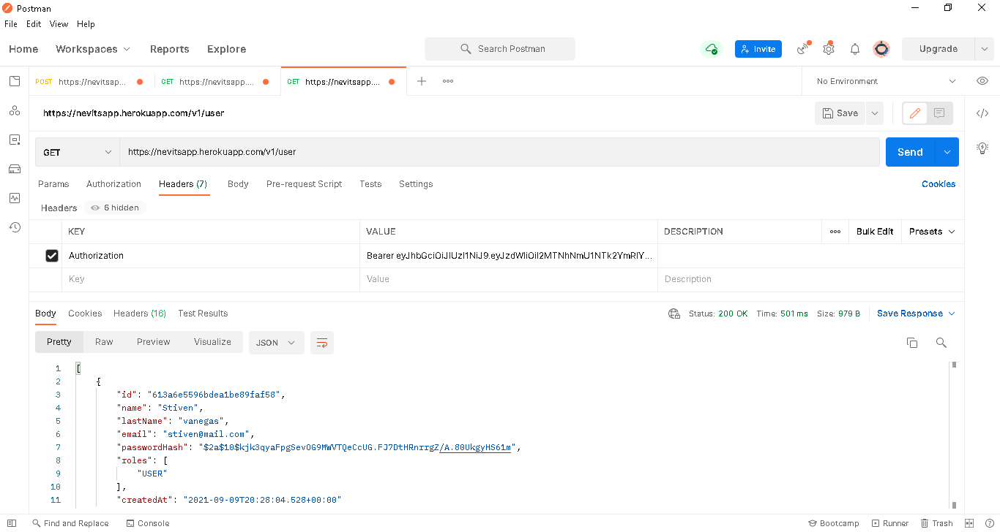

# Login User Backend
Implementación de API REST con Java, Spring Boot + Conexión con MongoDB

## Despliegue en Heroku

## Pruebas de ejemplo con Postman
* Este endpoint nos muestra el estado del API, este no requiere de token de autorización.

* Antes de hacer la autenticación, observemos lo que sucede al realizar una peticion en un endpoint que si requiere de token de autorización. Manda error 403.

* Para obtener el token de autorización usamos el endpoint de autenticación, en este ejemplo hago uso de un usuaio previamente creado (el usuario se envia como un JSON), enviamos la petición y obtenemos el token.

* Ahora vamos a usar el mismo endpoint que anteriormente nos mando el error, pero en esta ocasión insertamos en el header el token que obtuvimos. finalmente ya tenemos acceso al enpoint y podemos ver su contenido en este caso la lista de usuarios.

### Documentación de referencia
Para mayor referencia, considere las siguientes secciones:

* [Official Apache Maven documentation](https://maven.apache.org/guides/index.html)
* [Spring Boot Maven Plugin Reference Guide](https://docs.spring.io/spring-boot/docs/2.5.4/maven-plugin/reference/html/)
* [Create an OCI image](https://docs.spring.io/spring-boot/docs/2.5.4/maven-plugin/reference/html/#build-image)
* [Spring Web](https://docs.spring.io/spring-boot/docs/2.5.4/reference/htmlsingle/#boot-features-developing-web-applications)
* [Spring Data MongoDB](https://docs.spring.io/spring-boot/docs/2.5.4/reference/htmlsingle/#boot-features-mongodb)
* [Spring Security](https://docs.spring.io/spring-boot/docs/2.5.4/reference/htmlsingle/#boot-features-security)

### Guías
Las siguientes guías ilustran cómo utilizar algunas funciones de forma concreta:

* [Building a RESTful Web Service](https://spring.io/guides/gs/rest-service/)
* [Serving Web Content with Spring MVC](https://spring.io/guides/gs/serving-web-content/)
* [Building REST services with Spring](https://spring.io/guides/tutorials/bookmarks/)
* [Accessing Data with MongoDB](https://spring.io/guides/gs/accessing-data-mongodb/)
* [Securing a Web Application](https://spring.io/guides/gs/securing-web/)
* [Spring Boot and OAuth2](https://spring.io/guides/tutorials/spring-boot-oauth2/)
* [Authenticating a User with LDAP](https://spring.io/guides/gs/authenticating-ldap/)

